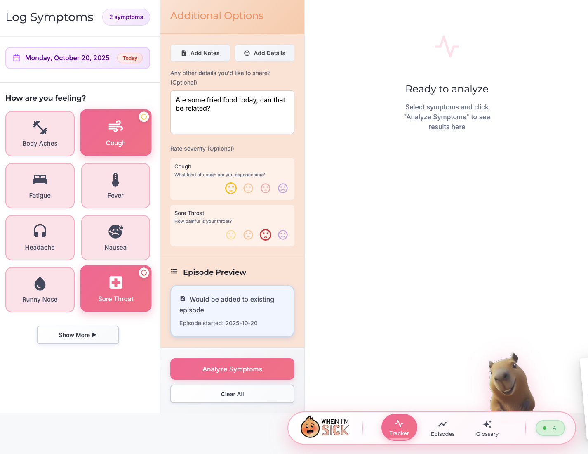
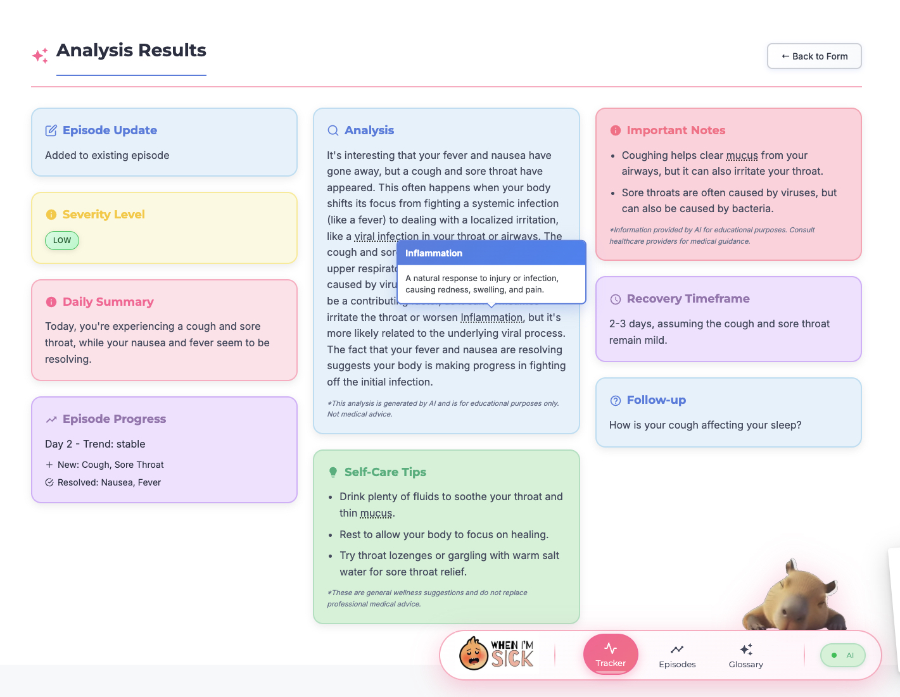
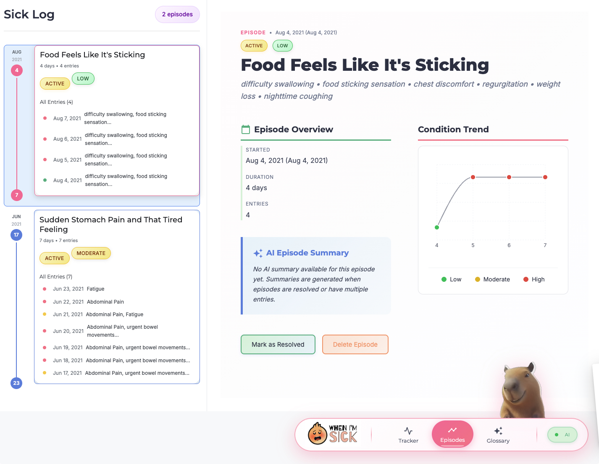
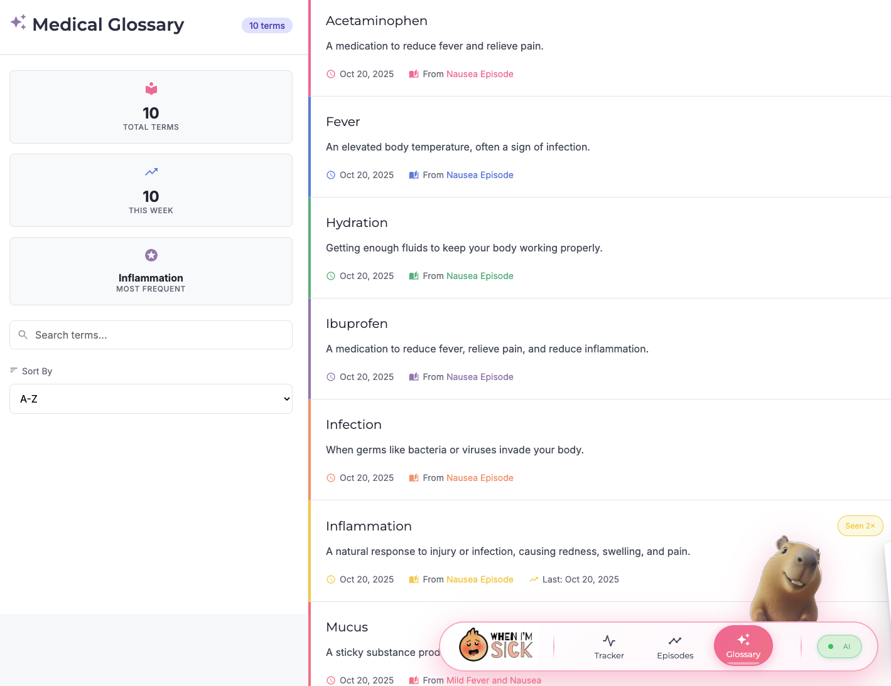

# When I'm Sick - Chrome AI Symptom Tracker

A Next.js web app that uses Chrome's built-in AI (Gemini Nano) to analyze symptoms and provide health insights. **Completely offline and private.**

### Screenshots

<div align="center">
  
  
</div>

<div align="center">
  
  
</div>

### What It Does

- **Track Symptoms**: Select from common/uncommon symptoms with severity levels
- **AI Analysis**: Get instant analysis using Chrome's local AI (no data sent anywhere)
- **Health Insights**: Educational information, self-care tips, and medical guidance
- **Episode Tracking**: Multi-day illness progression with trend analysis
- **Medical Glossary**: Interactive tooltips for medical terms

### Quick Start

1. **Setup Chrome**:
   - Install Chrome (version 127 or later)
   - Enable the following flags in `chrome://flags`:
     - `#prompt-api-for-gemini-nano` → **Enabled**
     - `#prompt-api-for-gemini-nano-multimodal-input` → **Enabled**
     - `#optimization-guide-on-device-model` → **Enabled BypassPerfRequirement**
   - Restart browser

2. **Run the app**:
   ```bash
   npm install
   npm run dev
   ```
   Open http://localhost:3000 in Chrome

### Tech Stack

- **Frontend**: Next.js 15, React 19, TypeScript
- **Styling**: Tailwind CSS 4
- **AI**: Chrome's built-in Gemini Nano (offline)
- **Storage**: LocalStorage (no external APIs)
- **Icons**: React Icons

### Features

- Symptom selection with severity tracking
- Chrome AI-powered analysis (offline)
- Multi-day episode progression
- Interactive medical term tooltips
- Responsive design
- 100% private (no data leaves your device)

### Project Structure

```
src/
├── app/                 # Next.js pages
├── components/          # React components
├── lib/                # Chrome AI integration
├── services/           # Data management
└── types/              # TypeScript definitions
```

### Disclaimer

**For educational purposes only. Not medical advice. Consult healthcare professionals for medical concerns.**